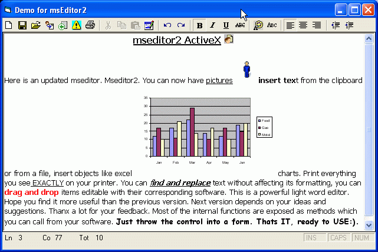

<div align="center">

## mseditor2\.ocx \(Greatly updated version of mseditor\.ocx\)


</div>

### Description

Here is mseditor2 greatly updated from mseditor1. I received many emails with a lot of ideas as to what to add to the control. This is the new version. Now you can print WYSIWYG, insert pictures, files and OBJECTS (Like msword Charts, excel, ANYTHING). You can find and replace text without affecting its formatting. There is a status line with current line, column total lines etc. I did remove the databound properties but this is only a couple of lines of code anyway. You can always implement this outside the control. If there is interest I will add more features. The whole idea is the same. Just THROW the control into a form and USE IT. In the examples in the screenshots below there is absolutely no code in the form, JUST the control. It is fully parametric with a lot of exposed ‘methods’ which you can call from your program. There is a technique for a form to call back on the control (in the find replace form). This might be educating to novice programmers. If you don’t want almost instant status refresh then remove the timer and its code. The status gets informed when you change something or click the mouse somewhere. It’s a lean mean word editor and with your help it gets better all the time. Thanks for your feedback, both online and into my mail box.
 
### More Info
 


<span>             |<span>
---                |---
**Submitted On**   |2005-02-20 04:19:40
**By**             |[Makis Charalambous](https://github.com/Planet-Source-Code/PSCIndex/blob/master/ByAuthor/makis-charalambous.md)
**Level**          |Intermediate
**User Rating**    |4.8 (48 globes from 10 users)
**Compatibility**  |VB 6\.0
**Category**       |[Custom Controls/ Forms/  Menus](https://github.com/Planet-Source-Code/PSCIndex/blob/master/ByCategory/custom-controls-forms-menus__1-4.md)
**World**          |[Visual Basic](https://github.com/Planet-Source-Code/PSCIndex/blob/master/ByWorld/visual-basic.md)
**Archive File**   |[mseditor2\_1855122192005\.zip](https://github.com/Planet-Source-Code/makis-charalambous-mseditor2-ocx-greatly-updated-version-of-mseditor-ocx__1-59019/archive/master.zip)

### API Declarations

```
Exposed methods (besides the standard)
---------------------------------------
msOpen
PrintText
Undo
Redo
InsertPicture
InsertObject
InsertFile
FindReplaceDialog
FindReplace
SaveNow
```


